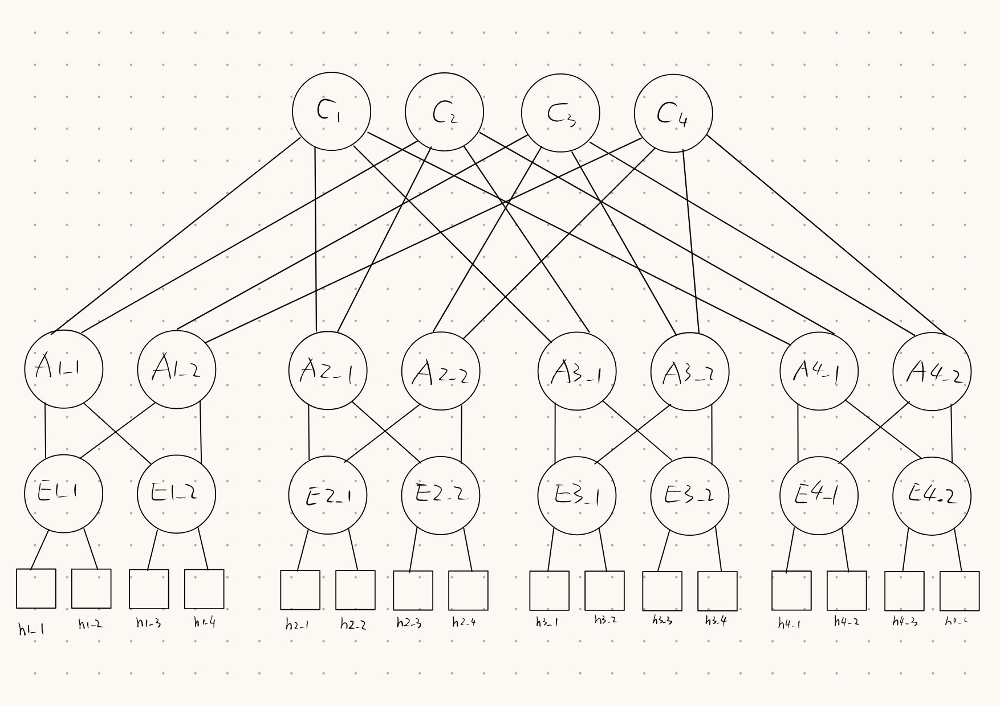
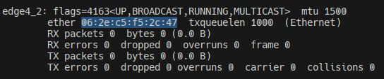

# Mininet

Copyleft @Orion-zhen

## 使用`Pythhon Mininet`创建`k=4`的`fat tree`拓扑



根据上图可以构造如下代码:

```python
def build(self):
    # Pod1
    h1_1 = self.addHost("h1_1")
    h1_2 = self.addHost("h1_2")
    edge1_1 = self.addSwitch("edge1_1")
    self.addLink(h1_1, edge1_1)
    self.addLink(h1_2, edge1_1)
    h1_3 = self.addHost("h1_3")
    h1_4 = self.addHost("h1_4")
    edge1_2 = self.addSwitch("edge1_2")
    self.addLink(h1_3, edge1_2)
    self.addLink(h1_4, edge1_2)
    aggr1_1 = self.addSwitch("aggr1_1")
    aggr1_2 = self.addSwitch("aggr1_2")
    self.addLink(edge1_1, aggr1_1)
    self.addLink(edge1_2, aggr1_1)
    self.addLink(edge1_1, aggr1_2)
    self.addLink(edge1_2, aggr1_2)

    # Pod2
    h2_1 = self.addHost("h2_1")
    h2_2 = self.addHost("h2_2")
    edge2_1 = self.addSwitch("edge2_1")
    self.addLink(h2_1, edge2_1)
    self.addLink(h2_2, edge2_1)
    h2_3 = self.addHost("h2_3")
    h2_4 = self.addHost("h2_4")
    edge2_2 = self.addSwitch("edge2_2")
    self.addLink(h2_3, edge2_2)
    self.addLink(h2_4, edge2_2)
    aggr2_1 = self.addSwitch("aggr2_1")
    aggr2_2 = self.addSwitch("aggr2_2")
    self.addLink(edge2_1, aggr2_1)
    self.addLink(edge2_2, aggr2_1)
    self.addLink(edge2_1, aggr2_2)
    self.addLink(edge2_2, aggr2_2)

    # Pod3
    h3_1 = self.addHost("h3_1")
    h3_2 = self.addHost("h3_2")
    edge3_1 = self.addSwitch("edge3_1")
    self.addLink(h3_1, edge3_1)
    self.addLink(h3_2, edge3_1)
    h3_3 = self.addHost("h3_3")
    h3_4 = self.addHost("h3_4")
    edge3_2 = self.addSwitch("edge3_2")
    self.addLink(h3_3, edge3_2)
    self.addLink(h3_4, edge3_2)
    aggr3_1 = self.addSwitch("aggr3_1")
    aggr3_2 = self.addSwitch("aggr3_2")
    self.addLink(edge3_1, aggr3_1)
    self.addLink(edge3_2, aggr3_1)
    self.addLink(edge3_1, aggr3_2)
    self.addLink(edge3_2, aggr3_2)

    # Pod4
    h4_1 = self.addHost("h4_1")
    h4_2 = self.addHost("h4_2")
    edge4_1 = self.addSwitch("edge4_1")
    self.addLink(h4_1, edge4_1)
    self.addLink(h4_2, edge4_1)
    h4_3 = self.addHost("h4_3")
    h4_4 = self.addHost("h4_4")
    edge4_2 = self.addSwitch("edge4_2")
    self.addLink(h4_3, edge4_2)
    self.addLink(h4_4, edge4_2)
    aggr4_1 = self.addSwitch("aggr4_1")
    aggr4_2 = self.addSwitch("aggr4_2")
    self.addLink(edge4_1, aggr4_1)
    self.addLink(edge4_2, aggr4_1)
    self.addLink(edge4_1, aggr4_2)
    self.addLink(edge4_2, aggr4_2)

    # Core
    core1 = self.addSwitch("core1")
    core2 = self.addSwitch("core2")
    core3 = self.addSwitch("core3")
    core4 = self.addSwitch("core4")

    self.addLink(aggr1_1, core1)
    self.addLink(aggr1_1, core2)
    self.addLink(aggr1_2, core3)
    self.addLink(aggr1_2, core4)

    self.addLink(aggr2_1, core1)
    self.addLink(aggr2_1, core2)
    self.addLink(aggr2_2, core3)
    self.addLink(aggr2_2, core4)

    self.addLink(aggr3_1, core1)
    self.addLink(aggr3_1, core2)
    self.addLink(aggr3_2, core3)
    self.addLink(aggr3_2, core4)

    self.addLink(aggr4_1, core1)
    self.addLink(aggr4_1, core2)
    self.addLink(aggr4_2, core3)
    self.addLink(aggr4_2, core4)
```

但是`pingall`却无法`ping`通


这是因为在未经配置的`fat tree`中是存在环路的, 而`ping`报文在环路中会形成广播风暴, 从而导致没有任何一台主机能正常收到`ping`报文

## 避免环路广播

生成树协议是一个解决方案, 而且有`ovs-vsctl set bridge <switch_name> stp_enable=true`可以方便地启用STP协议, 但是考虑到运行完STP协议后, `fat tree`将会退化为一颗平凡的树, 而且对于`k=4`的情况, 有4个等价的`core switch`, STP协议只能选择其中一个为根

总而言之, STP会破坏`fat tree`的特性, 于是我们选择手动为每个switch配置静态流表:

```python
# configuring static flow table
# generally speaking, port 1&2 are south ports, while port3&4 are north ports
# edge switch upward flows
os.system("ovs-ofctl add-flow edge1_1 in_port=1,actions=output:2,output:3,output:4")
os.system("ovs-ofctl add-flow edge1_1 in_port=2,actions=output:1,output:3,output:4")
os.system("ovs-ofctl add-flow edge1_2 in_port=1,actions=output:2,output:3,output:4")
os.system("ovs-ofctl add-flow edge1_2 in_port=2,actions=output:1,output:3,output:4")
os.system("ovs-ofctl add-flow edge2_1 in_port=1,actions=output:2,output:3,output:4")
os.system("ovs-ofctl add-flow edge2_1 in_port=2,actions=output:1,output:3,output:4")
os.system("ovs-ofctl add-flow edge2_2 in_port=1,actions=output:2,output:3,output:4")
os.system("ovs-ofctl add-flow edge2_2 in_port=2,actions=output:1,output:3,output:4")
os.system("ovs-ofctl add-flow edge3_1 in_port=1,actions=output:2,output:3,output:4")
os.system("ovs-ofctl add-flow edge3_1 in_port=2,actions=output:1,output:3,output:4")
os.system("ovs-ofctl add-flow edge3_2 in_port=1,actions=output:2,output:3,output:4")
os.system("ovs-ofctl add-flow edge3_2 in_port=2,actions=output:1,output:3,output:4")
os.system("ovs-ofctl add-flow edge4_1 in_port=1,actions=output:2,output:3,output:4")
os.system("ovs-ofctl add-flow edge4_1 in_port=2,actions=output:1,output:3,output:4")
os.system("ovs-ofctl add-flow edge4_2 in_port=1,actions=output:2,output:3,output:4")
os.system("ovs-ofctl add-flow edge4_2 in_port=2,actions=output:1,output:3,output:4")
# edge switch downward flows
os.system("ovs-ofctl add-flow edge1_1 in_port=3,actions=output:1,output:2")
os.system("ovs-ofctl add-flow edge1_1 in_port=4,actions=output:1,output:2")
os.system("ovs-ofctl add-flow edge1_2 in_port=3,actions=output:1,output:2")
os.system("ovs-ofctl add-flow edge1_2 in_port=4,actions=output:1,output:2")
os.system("ovs-ofctl add-flow edge2_1 in_port=3,actions=output:1,output:2")
os.system("ovs-ofctl add-flow edge2_1 in_port=4,actions=output:1,output:2")
os.system("ovs-ofctl add-flow edge2_2 in_port=3,actions=output:1,output:2")
os.system("ovs-ofctl add-flow edge2_2 in_port=4,actions=output:1,output:2")
os.system("ovs-ofctl add-flow edge3_1 in_port=3,actions=output:1,output:2")
os.system("ovs-ofctl add-flow edge3_1 in_port=4,actions=output:1,output:2")
os.system("ovs-ofctl add-flow edge3_2 in_port=3,actions=output:1,output:2")
os.system("ovs-ofctl add-flow edge3_2 in_port=4,actions=output:1,output:2")
os.system("ovs-ofctl add-flow edge4_1 in_port=3,actions=output:1,output:2")
os.system("ovs-ofctl add-flow edge4_1 in_port=4,actions=output:1,output:2")
os.system("ovs-ofctl add-flow edge4_2 in_port=3,actions=output:1,output:2")
os.system("ovs-ofctl add-flow edge4_2 in_port=4,actions=output:1,output:2")
# aggr switch upward flows
os.system("ovs-ofctl add-flow aggr1_1 in_port=1,actions=output:2,output:3,output:4")
os.system("ovs-ofctl add-flow aggr1_1 in_port=2,actions=output:1,output:3,output:4")
os.system("ovs-ofctl add-flow aggr1_2 in_port=1,actions=output:2,output:3,output:4")
os.system("ovs-ofctl add-flow aggr1_2 in_port=2,actions=output:1,output:3,output:4")
os.system("ovs-ofctl add-flow aggr2_1 in_port=1,actions=output:2,output:3,output:4")
os.system("ovs-ofctl add-flow aggr2_1 in_port=2,actions=output:1,output:3,output:4")
os.system("ovs-ofctl add-flow aggr2_2 in_port=1,actions=output:2,output:3,output:4")
os.system("ovs-ofctl add-flow aggr2_2 in_port=2,actions=output:1,output:3,output:4")
os.system("ovs-ofctl add-flow aggr3_1 in_port=1,actions=output:2,output:3,output:4")
os.system("ovs-ofctl add-flow aggr3_1 in_port=2,actions=output:1,output:3,output:4")
os.system("ovs-ofctl add-flow aggr3_2 in_port=1,actions=output:2,output:3,output:4")
os.system("ovs-ofctl add-flow aggr3_2 in_port=2,actions=output:1,output:3,output:4")
os.system("ovs-ofctl add-flow aggr4_1 in_port=1,actions=output:2,output:3,output:4")
os.system("ovs-ofctl add-flow aggr4_1 in_port=2,actions=output:1,output:3,output:4")
os.system("ovs-ofctl add-flow aggr4_2 in_port=1,actions=output:2,output:3,output:4")
os.system("ovs-ofctl add-flow aggr4_2 in_port=2,actions=output:1,output:3,output:4")
# aggr switch downward flows
os.system("ovs-ofctl add-flow aggr1_1 in_port=3,actions=output:1,output:2")
os.system("ovs-ofctl add-flow aggr1_1 in_port=4,actions=output:1,output:2")
os.system("ovs-ofctl add-flow aggr1_2 in_port=3,actions=output:1,output:2")
os.system("ovs-ofctl add-flow aggr1_2 in_port=4,actions=output:1,output:2")
os.system("ovs-ofctl add-flow aggr2_1 in_port=3,actions=output:1,output:2")
os.system("ovs-ofctl add-flow aggr2_1 in_port=4,actions=output:1,output:2")
os.system("ovs-ofctl add-flow aggr2_2 in_port=3,actions=output:1,output:2")
os.system("ovs-ofctl add-flow aggr2_2 in_port=4,actions=output:1,output:2")
os.system("ovs-ofctl add-flow aggr3_1 in_port=3,actions=output:1,output:2")
os.system("ovs-ofctl add-flow aggr3_1 in_port=4,actions=output:1,output:2")
os.system("ovs-ofctl add-flow aggr3_2 in_port=3,actions=output:1,output:2")
os.system("ovs-ofctl add-flow aggr3_2 in_port=4,actions=output:1,output:2")
os.system("ovs-ofctl add-flow aggr4_1 in_port=3,actions=output:1,output:2")
os.system("ovs-ofctl add-flow aggr4_1 in_port=4,actions=output:1,output:2")
os.system("ovs-ofctl add-flow aggr4_2 in_port=3,actions=output:1,output:2")
os.system("ovs-ofctl add-flow aggr4_2 in_port=4,actions=output:1,output:2")
# for core switches, there is no upward flow, just flood!
```

如此配置后, 就能够`ping`通了:


以`h1_1 -> h4_4`为例, 展示数据包流向:


## 后续: 尝试STP协议

### 错误信息


可以看到, STP协议并未起作用, 主机之间仍然不能`ping`通

以`edge1_1`为例进行分析, 打印`edge1_1`的相关信息:


可以发现, `edge1_1`将自己所有收到的报文都`drop`, 不做任何转发; MAC表也未学习到任何内容

进一步地, 使用wireshark抓包, 试图分析STP协议运行细节:


可以看到, 在运行协议后, `fat tree`中各个交换机选择将`06:2e:c5:f5:2c:47`这个节点作为根节点, 查看`ifconfig`命令输出, 可以发现, 这是`edge4_2`交换机的MAC地址:



这并不是一个合理的根节点, 在4个`core`交换机中选取根节点是更合理的

另外可以注意到, `edge1_1`计算得到自己距离`edge4_2`的代价为6, 然而事实上从`fat tree`的拓扑图可以看出, 存在更小的代价, 其值为4

接着, 尝试`h1_1 ping h4_4 -c1`, 在与`h1_1`直接相连的`edge1_1-eth1`上抓取到如下报文:


可以看到, 为了发送`ping`消息, `h1_1`首先运行了ARP协议. 可是`edge1_1`已经自我配置为将所有收到的报文都`drop`, 故`h1_1`不会收到任何回复

抓取`edge1_1-eth4`端口的消息, 验证了上述结论:


### 问题分析

可以看到, STP协议似乎不是很适用于类似`fat tree`这样的复杂网络拓扑, 不仅在于可能会不合理地选择根节点以及计算节点之间的代价, 还在于STP不支持多路径利用, 对于`fat tree`这种以多路径为特征的网络, STP带来的链路资源浪费是难以接受的
