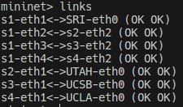
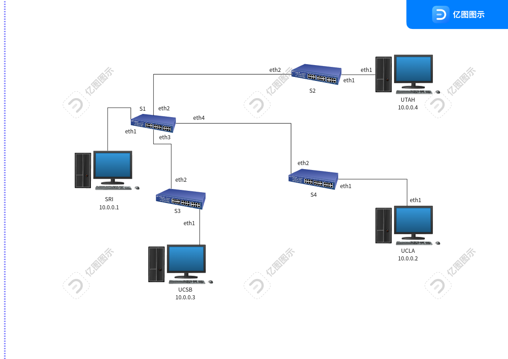
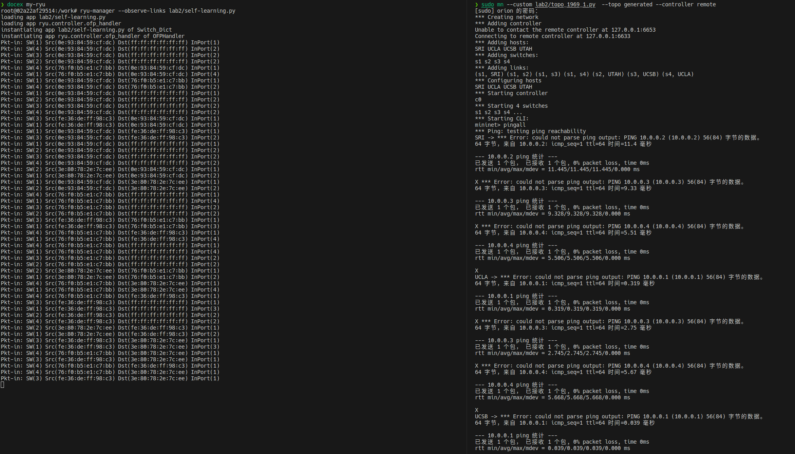
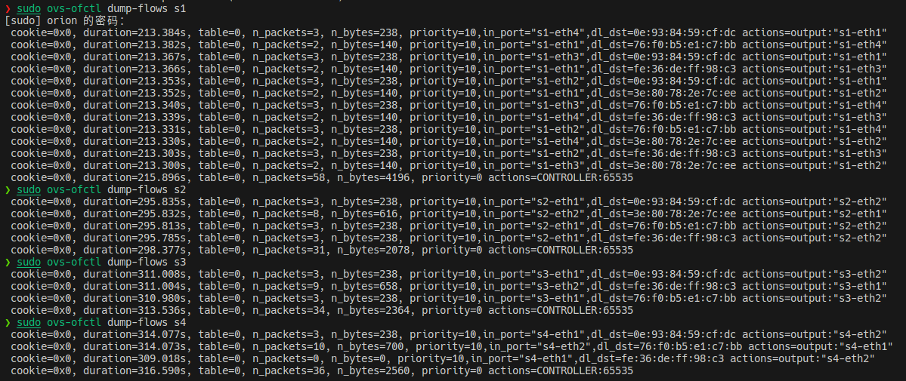
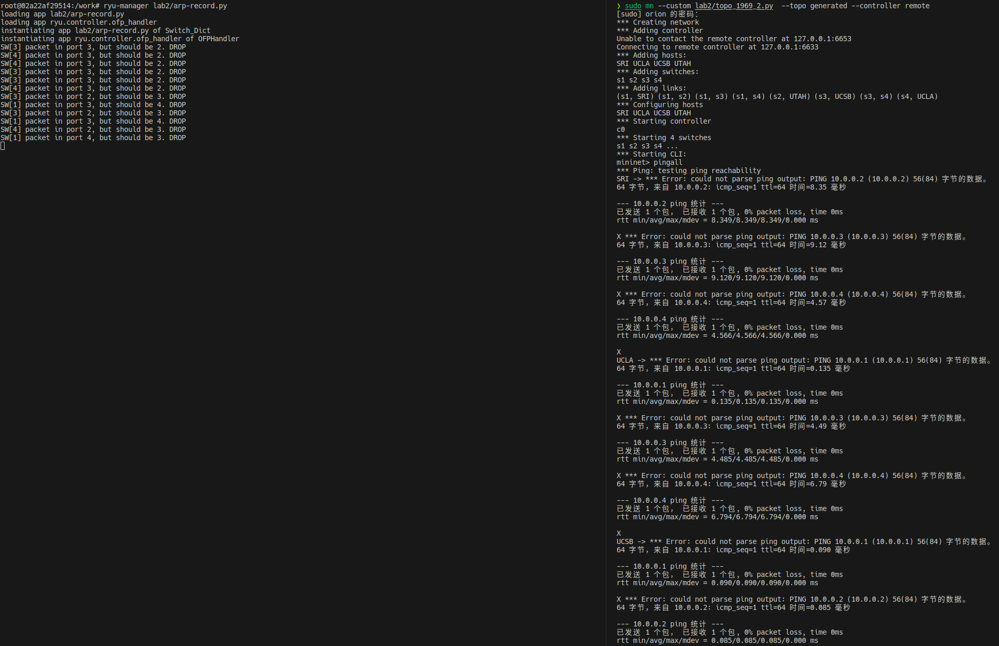
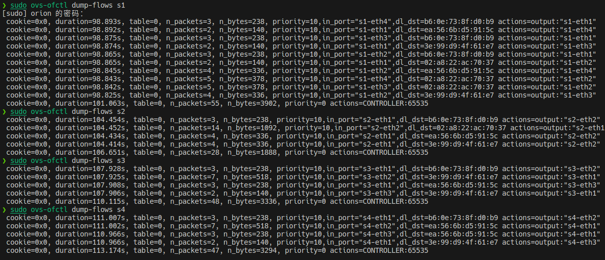
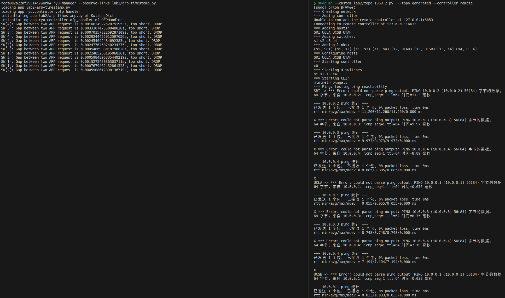
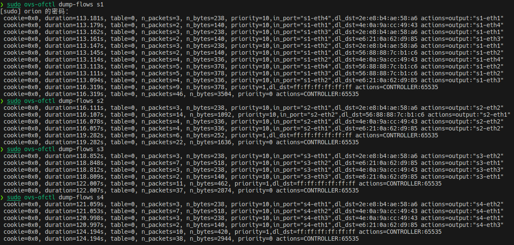
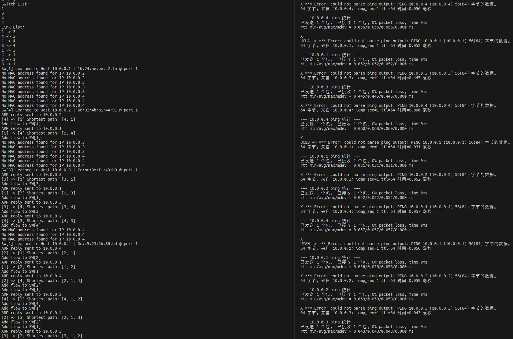
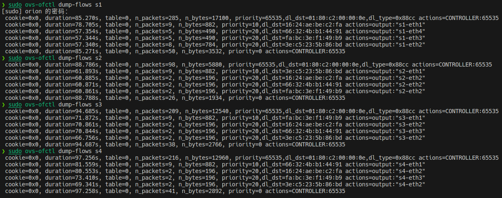

# Self-learning Switch

## 环境搭建

由于我使用的系统是[ArchLinux](https://archlinux.org), 所以我更倾向于在本地搭建所需环境, 而不是使用封装好的镜像. 这样也能加深我对实验的理解

经过实践, 阅读相关文档和源码, 我了解到:

1. `ryu`不能运行在`Python 3.10`版本及以上, 因为`Python 3.10`删除和变化了许多属性和方法, 导致`ryu`无法运行. 例如`TypeError: cannot set 'is_timeout' attribute of immutable type 'TimeoutError`
2. `ryu`自己的依赖项版本有误, `eventlet`模块需要手动降级成`0.30.2`, 否则会有诸如`ImportError: cannot import name 'ALREADY_HANDLED' from 'eventlet.wsgi'`的错误

在尝试多种解决方案后, 我决定自行构建docker容器来运行:

```dockerfile
FROM ubuntu:20.04
LABEL maintainer="Orion-zhen"
RUN apt update && apt install -y python3 python3-pip python-is-python3 vim && pip3 install ryu && pip3 install eventlet==0.30.2 && pip3 install networkx
EXPOSE 6633 8080
WORKDIR /work
COPY ./ /work/
```

## 自学习交换机

### 拓扑图

> 值得注意的是, `sudo python topo_1969_1.py`会报错, 需要执行`sudo mn --custom topo_1969_1.py --topo generated --controller remote`

成功运行后, 使用`links`查看链路情况:



依此绘制出拓扑图:



### 自学习方法

当交换机上报一个`Packet In`消息给控制器后, 控制器检查该消息携带的是否为`Ethernet`类型报文. 如果是, 则提取出`eth_src`和`in_port`, 建立映射关系

当后续`Ethernet`类型报文进入时, 控制器检测是否已学习到该报文中`dst_mac`对应的`in_port`, 如果是, 则下发对应流表, 否则洪泛

### 代码实现

在`Switch`类中, 定义一个全局字典, 来维护*所有*交换机的`mac`到端口的映射关系:

```python
class Switch(app_manager.RyuApp):
    def __init__(self, *args, **kwargs):
        # other code

        # switch_id, mac -> port
        self.mac_to_port = {}
```

当后续`Ethernet`报文进入控制器时, 检查其目的`mac`地址:

```python
def packet_in_handler(self, ev):
    # other code

    self.mac_to_port[dpid][src] = in_port
    if dst in self.mac_to_port[dpid]:
        # have learned the mac-port mapping
        out_port = self.mac_to_port[dpid][dst]
    else:
        # no, just flood
        out_port = ofp.OFPP_FLOOD
    # output the packet
    actions = [parser.OFPActionOutput(out_port)]

    # if learned a new mapping, add the flow table to switch
    if out_port != ofp.OFPP_FLOOD:
        match = parser.OFPMatch(in_port=in_port, eth_dst=dst)
        # set priority to 10 to avoid flow table shadowing
        self.add_flow(dp, 10, match, actions)
```

### 运行结果

`pingall`结果:



查看各交换机流表:



## 避免环路广播

### 拓扑图

同理有:


可以看到, 图中`S1`, `S3`, `S4`形成了一条环路, `ARP Request`报文会一直在环路中循环广播, 导致交换机无法正确学习`mac`到端口的映射关系

### 避免方法

记录首次`ARP Request`报文进入交换机的端口, 如果下次收到同样内容的`ARP Request`, 则检测进入的端口号, 如果和记录的不同, 则说明网络中可能存在环路, 将该数据包丢弃

### 代码实现

在`Switch`类中, 定义一个全局字典`arp_in_port`, 来记录首次`ARP Request`报文进入交换机的端口:

```python
class Switch(app_manager.RyuApp):
    def __init__(self, *args, **kwargs):
        # other code
        self.arp_in_port = {}
```

当收到`ARP Request`报文时, 检查是否已经学习到了映射关系:

```python
# ARP request packet
if arp_pkt.opcode == arp.ARP_REQUEST:
    req_dst_ip = arp_pkt.dst_ip
    arp_src_mac = arp_pkt.src_mac

    # learned the mac in mapping
    if arp_src_mac in self.arp_in_port[dpid]:
        # learned the ip in mapping
        if req_dst_ip in self.arp_in_port[dpid][arp_src_mac]:
```

如果该报文进入的端口和之前记录的不一致, 则丢弃:

```python
            if in_port != self.arp_in_port[dpid][arp_src_mac][req_dst_ip]:
                match = parser.OFPMatch(
                    in_port=in_port,
                    arp_op=arp.ARP_REQUEST,
                    arp_tpa=req_dst_ip,
                    arp_sha=arp_src_mac,
                )
                actions = []
                # higher than self-learning
                self.add_flow(dp, 20, match, actions)

                out = parser.OFPPacketOut(
                    datapath=dp,
                    buffer_id=msg.buffer_id,
                    in_port=in_port,
                    actions=[],
                    data=None,
                )
                dp.send_msg(out)
                return
```

否则, 记录这条报文:

```python
        # no req_dst_ip in mapping
        else:
            # learn the req_dst_ip and in_port
            self.arp_in_port[dpid][arp_src_mac].setdefault(req_dst_ip, {})
            self.arp_in_port[dpid][arp_src_mac][req_dst_ip] = in_port
    # no arp_src_mac in mapping
    else:
        self.arp_in_port[dpid].setdefault(arp_src_mac, {})
        self.arp_in_port[dpid][arp_src_mac][req_dst_ip] = in_port
```

### 运行结果

`pingall`结果:



查看各交换机流表:



## 附加题

### 时间戳方案

#### 思想简述

一个`ARP Record`有一定的生存期, 在这个生存期内, 如果出现了多个`ARP Request`报文, 则只记录第一个报文, 忽略后面的报文. 查询资料可知: 一个`ARP Record`的生存期大约为120s

#### 代码实现

定义一个`ARP_TIMEOUT`常量来表征超时时间:

```python
ARP_TIMEOUT = 120
```

在`Switch`类中, 定义一个全局字典`latest_stamp`, 来记录最近一次有效`ARP Request`报文进入交换机时间戳:

```python
class Switch(app_manager.RyuApp):
    def __init__(self, *args, **kwargs):
        # other code

        # dpid, src_ip, dst_ip -> timestamp
        self.latest_stamp = {}
```

在收到`ARP_Request`报文时, 检查是否已经学习到了映射关系, 如果是第一次收到该报文, 则记录时间戳:

```python
def packet_in_handler(self, ev):
    # other code

    if arp_pkt.opcode == arp.ARP_REQUEST:
        # ARP request
        # get the ip
        arp_src_ip = arp_pkt.src_ip
        arp_dst_ip = arp_pkt.dst_ip
        # arp for the first time
        if arp_src_ip not in self.latest_stamp[dpid]:
            self.latest_stamp[dpid].setdefault(arp_src_ip, {})
            self.latest_stamp[dpid][arp_src_ip][arp_dst_ip] = ev.timestamp
        # another dst ip, update, too
        elif arp_dst_ip not in self.latest_stamp[dpid][arp_src_ip]:
            self.latest_stamp[dpid][arp_src_ip].setdefault(arp_dst_ip, {})
            self.latest_stamp[dpid][arp_src_ip][arp_dst_ip] = ev.timestamp
```

否则, 判断是否超时:

```python
        elif ev.timestamp - self.latest_stamp[dpid][arp_src_ip][arp_dst_ip] < ARP_TIMEOUT:
            print(f"SW[{dpid}]: Gap between two ARP request is {ev.timestamp - self.latest_stamp[dpid][arp_src_ip][arp_dst_ip]}s, too short. DROP")
            return
```

#### 运行结果

`pingall`结果:



查看各交换机流表:



### SDN方案

#### 思想简述

`ARP Request`统一交由控制器处理, 由控制器根据整个拓扑决定报文发送的路径, 并对路径上的各个交换机下发流表

必须先运行一次`pingall`命令, 让控制器学习到所有`Host`的`mac`地址和链路情况, 才能运行寻路算法

> 我真的写不动了, 就用`networkx`包来计算最短路径了

#### 代码实现

在`Switch`类中, 定义一些用来表征拓扑结构的变量:

```python
import networkx as nx


class Switch(app_manager.RyuApp):
    def __init__(self, *args, **kwargs):
        super(Switch_Dict, self).__init__(*args, **kwargs)
        # links between switches and hosts
        # switch_id -> {host_ip -> host_mac}
        self.switch_to_host = {}
        # links between switches
        # switch_id -> {switch_id -> out_port}
        self.switch_to_switch = {}
        # switch entities
        self.dp = {}
        # an api to get the topo of switches
        self.topo_api = self
        # the topo graph
        self.G = nx.Graph()
```

对于接收到的`ARP Request`报文, 检查是否该交换机是否有到请求方的直接连接:

```python
def packet_in_handler(self, ev):
    # other code

    if arp_pkt.opcode == arp.ARP_REQUEST:
        arp_src_ip = arp_pkt.src_ip
        arp_src_mac = arp_pkt.src_mac

        arp_dst_ip = arp_pkt.dst_ip

        # the switch knows the mac
        if arp_src_ip in self.switch_to_host[dpid]:
```

如果有, 则直接让该交换机构造`ARP Reply`报文回复之:

```python
            # construct an arp reply
            reply_eth_dst = None
            # traverse to find the corresponding mac
            for switch in self.switch_to_host:
                if arp_dst_ip in self.switch_to_host[switch]:
                    reply_eth_dst = self.switch_to_host[switch][arp_dst_ip][
                        "mac"
                    ]
                    break
            if reply_eth_dst == None:
                print(f"No MAC address found for IP {arp_dst_ip}")
                return

            arp_reply = packet.Packet()
            # ethernet protocol
            arp_reply.add_protocol(
                ethernet.ethernet(
                    ethertype=eth_pkt.ethertype,
                    dst=eth_src,
                    src=reply_eth_dst,
                )
            )
            # arp protocol
            arp_reply.add_protocol(
                arp.arp(
                    opcode=arp.ARP_REPLY,
                    src_mac=reply_eth_dst,
                    src_ip=arp_dst_ip,
                    dst_mac=arp_src_mac,
                    dst_ip=arp_src_ip,
                )
            )
            # serialize an object to raw binary string
            arp_reply.serialize()
            actions = [parser.OFPActionOutput(in_port)]
            out = parser.OFPPacketOut(
                datapath=dp,
                buffer_id=ofp.OFP_NO_BUFFER,
                in_port=ofp.OFPP_CONTROLLER,
                actions=actions,
                data=arp_reply.data,
            )
            dp.send_msg(out)
            print(f"ARP reply sent to {arp_src_ip}")
```

如果没有, 则学习这一条`Switch`和`Host`的链接, 并下发流表:

```python
        # the switch doesn't know the mac
        else:
            self.switch_to_host[dpid].setdefault(arp_src_ip, {})
            self.switch_to_host[dpid][arp_src_ip]["mac"] = arp_src_mac
            self.switch_to_host[dpid][arp_src_ip]["port"] = in_port
            print(
                f"SW[{dpid}] Learned to Host {arp_src_ip} | {arp_src_mac} @ port {in_port}"
            )
            # add a flow table entity
            actions = [parser.OFPActionOutput(in_port)]
            match = parser.OFPMatch(eth_dst=arp_src_mac)
            self.add_flow(dp, 10, match, actions)
        return
```

对于其他情况, 则为这条报文寻找路径并对路径上的交换机逐个下发流表:

```python
    # deal with others
    # find the last hop switch to the target host
    dst_dpid = None
    found = False
    for switch in self.switch_to_host:
        for host in self.switch_to_host[switch]:
            if eth_dst == self.switch_to_host[switch][host]["mac"]:
                dst_dpid = switch
                found = True
                break
        if found:
            break

    # failed to find
    if dst_dpid == None:
        return

    shortest_path = nx.shortest_path(self.G, dpid, dst_dpid)
    print(f"[{dpid}] -> [{dst_dpid}] Shortest path: {shortest_path}")
    # configure flow table alongside the path
    for i in range(len(shortest_path) - 1):
        cur = shortest_path[i]
        next = shortest_path[i + 1]
        out_port = self.switch_to_switch[cur][next]

        actions = [parser.OFPActionOutput(out_port)]
        match = parser.OFPMatch(eth_dst=eth_dst)
        self.add_flow(self.dp[cur], 20, match, actions)
        print(f"Add flow to SW[{cur}]")

    data = None
    if msg.buffer_id == ofp.OFP_NO_BUFFER:
        data = msg.data

    # send to next hop
    cur = shortest_path[0]
    next = shortest_path[1]
    out_port = self.switch_to_switch[cur][next]
    actions = [parser.OFPActionOutput(out_port)]
    out = parser.OFPPacketOut(
        datapath=dp,
        buffer_id=msg.buffer_id,
        in_port=in_port,
        actions=actions,
        data=data,
    )
    dp.send_msg(out)
```

辅助函数, 用于构建`networkx`的拓扑图以方便运算:

```python
@set_ev_cls(event.EventSwitchEnter)
def get_topo(self, ev):
    # configure switches
    switch_list = get_switch(self.topo_api)
    node = []
    print("Switch List:")
    for sw in switch_list:
        node.append(sw.dp.id)
        # init switch links btw
        self.switch_to_switch.setdefault(sw.dp.id, {})
        print(sw.dp.id)
    self.G.add_nodes_from(node)

    # configure links
    link_list = get_link(self.topo_api)
    edge = []
    print("Link List:")
    for link in link_list:
        src = link.src.dpid
        dst = link.dst.dpid
        edge.append((src, dst))
        self.switch_to_switch[src][dst] = link.src.port_no
        self.switch_to_switch[dst][src] = link.dst.port_no
        print(f"{src} -> {dst}")
    self.G.add_edges_from(edge)
```

#### 运行结果

`pingall`结果:



查看各交换机流表:



> 值得注意的是, 在SDN方案中, `s1`的流表项数量少于其他方案, 且没有重复的流表项. 这是得益于控制器统一计算然后下发流表, 而不是每个交换机学习自己的流表

### 反对称方案

#### 思想简述

避免环路广播风暴的本质是去除一个无向图中的环路, 以上记录`ARP`端口和判断`ARP`时间戳方式都在规定报文的流向(即允许转发/禁止转发), SDN的方式则是在改变图中的边数来破除环路

以上思路破除的都是边的对称性, 那么是否能够破除节点的对称性呢?

即, 只允许一部分`Switch`向所有的端口洪泛报文, 其余的则仅能向连接`Host`的端口转发

> 然而遗憾的是, 受限于自身水平, 我无法提出一个有效的算法来给出允许洪泛的交换机集合, 更无法用代码实现了. 我太弱小了, 没有力量😭
