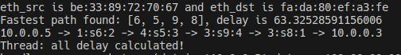
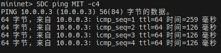
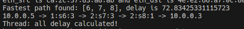
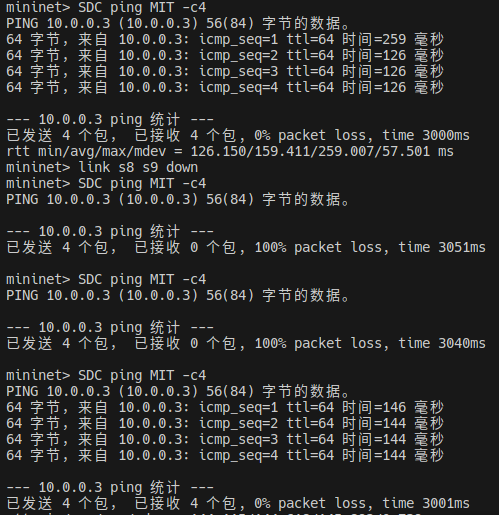
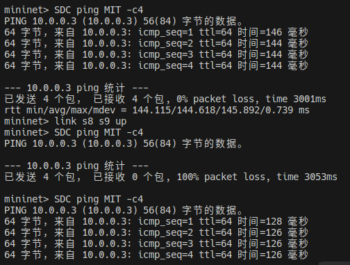

# LLDP delay

## 环境搭建

本次实验需要对ryu进行一些修改, 我已经上传到[github仓库](https://github.com/Orion-zhen/ryu-xjtu)

<span style="color: red">为了使代码中设定的链路时延能够起作用, 需要加上命令行参数: --link=tc</span>

即: `sudo mn --custom lab3/topo_1970.py --topo generated --controller remote --link=tc`

## 观测LLDP时延

根据指导书中的公式, `s1-s2`的时延为:

$delay_{12} = \frac{lldp\_delay_{12} + lldp\_delay_{21} - echo\_delay_1 - echo\_delay_2}{2}$

于是可以编写计算链路时延的代码:

```python
def get_delay(self):
    while True:
        for edge in self.topo_map.edges:
            # lldp(A->B) + lldp(B->A) - echo(A) - echo(B)
            delay_sum = (
                self.lldp_delay[edge]
                + self.lldp_delay[edge[::-1]]
                - self.echo_delay[edge[0]]
                - self.echo_delay[edge[1]]
            )
            weight = max(0, delay_sum / 2)
            self.topo_map[edge[0]][edge[1]]["weight"] = weight

        print("Thread: all delay calculated!")
        hub.sleep(GET_DELAY_INTERVAL)
```

在上述代码中, 我们将链路时延作为拓扑图的边的权重

使用一个全局的数据结构来存储链路时延:

```python
# echo_delay[dpid] = seconds
self.echo_delay = {}
```

当交换机接收到一个LLDP包, 并上报控制器时, 控制器采取如下行动:

- 找到对应的两个交换机
- 将时延记录到全局字典中

```python
def handle_lldp(self, lldp_pkt, msg):
    dpid = msg.datapath.id
    try:
        src_dpid, src_port_no = LLDPPacket.lldp_parse(msg.data)
    except LLDPPacket.LLDPUnknownFormat as e:
        # This handler can receive all the packtes which can be
        # not-LLDP packet. Ignore it silently
        print("receive a lldp unkown format")
        return
    if self.switches is None:
        self.switches = lookup_service_brick("switches")

    for port in self.switches.ports:
        if src_dpid == port.dpid and src_port_no == port.port_no:
            self.lldp_delay[(src_dpid, dpid)] = self.switches.ports[port].delay
```

对于IPv4的包, 则使用`networkx`包来计算最快路径, 并且下发流表:

```python
def handle_ipv4(self, ipv4_pkt, msg):
    ofp = msg.datapath.ofproto
    parser = msg.datapath.ofproto_parser

    ipv4_src = ipv4_pkt.src
    ipv4_dst = ipv4_pkt.dst

    dpid_begin = next(
        (dpid for dpid, ip_dict in self.switch_host.items() if ipv4_src in ip_dict),
        None,
    )
    port_begin = (
        self.switch_host.get(dpid_begin, {}).get(ipv4_src) if dpid_begin else None
    )

    dpid_final = next(
        (dpid for dpid, ip_dict in self.switch_host.items() if ipv4_dst in ip_dict),
        None,
    )
    port_final = (
        self.switch_host.get(dpid_final, {}).get(ipv4_dst) if dpid_final else None
    )

    short_path = nx.dijkstra_path(self.topo_map, dpid_begin, dpid_final)
    min_delay = nx.dijkstra_path_length(self.topo_map, dpid_begin, dpid_final)
    print(f"Fastest path found: {short_path}, delay is {min_delay * 1000}")

    path = f"{ipv4_src} -> {port_begin}:s{dpid_begin}"

    for i, cur_switch in enumerate(short_path):
        if i == 0:
            next_switch = short_path[i + 1]
            port = self.switch_switch[cur_switch][next_switch]
            path += f":{port} -> "

            # backwrd
            out_port = port_begin
            actions = [parser.OFPActionOutput(out_port)]
            match = parser.OFPMatch(
                eth_type=0x800, ipv4_src=ipv4_dst, ipv4_dst=ipv4_src
            )
            self.add_flow(self.datapath[cur_switch], 20, match, actions, 5, 10)

            # forward
            out_port = self.switch_switch[cur_switch][next_switch]
            actions = [parser.OFPActionOutput(out_port)]
            match = parser.OFPMatch(
                eth_type=0x800, ipv4_src=ipv4_src, ipv4_dst=ipv4_dst
            )
            self.add_flow(self.datapath[cur_switch], 20, match, actions, 5, 10)

        elif i == len(short_path) - 1:
            pre_switch = short_path[i - 1]
            port = self.switch_switch[cur_switch][pre_switch]
            path += f"{port}:s{cur_switch}"

            # backward
            out_port = port
            actions = [parser.OFPActionOutput(out_port)]
            match = parser.OFPMatch(
                eth_type=0x800, ipv4_src=ipv4_dst, ipv4_dst=ipv4_src
            )
            self.add_flow(self.datapath[cur_switch], 20, match, actions, 5, 10)

            # forward
            out_port = port_final
            actions = [parser.OFPActionOutput(out_port)]
            match = parser.OFPMatch(
                eth_type=0x800, ipv4_src=ipv4_src, ipv4_dst=ipv4_dst
            )
            self.add_flow(self.datapath[cur_switch], 20, match, actions, 5, 10)

        else:
            pre_switch = short_path[i - 1]
            next_switch = short_path[i + 1]
            port1 = self.switch_switch[cur_switch][pre_switch]
            port2 = self.switch_switch[cur_switch][next_switch]
            path += f"{port1}:s{cur_switch}:{port2} -> "

            # backward
            out_port = port1
            actions = [parser.OFPActionOutput(out_port)]
            match = parser.OFPMatch(
                eth_type=0x800, ipv4_src=ipv4_dst, ipv4_dst=ipv4_src
            )
            self.add_flow(self.datapath[cur_switch], 20, match, actions, 5, 10)

            # forward
            out_port = port2
            actions = [parser.OFPActionOutput(out_port)]
            match = parser.OFPMatch(
                eth_type=0x800, ipv4_src=ipv4_src, ipv4_dst=ipv4_dst
            )
            self.add_flow(self.datapath[cur_switch], 20, match, actions, 5, 10)
    path += f":{port_final} -> {ipv4_dst}"
    print(path)

    out_port = self.switch_switch[short_path[0]][short_path[1]]
    actions = [parser.OFPActionOutput(out_port)]
    data = None
    if msg.buffer_id == ofp.OFP_NO_BUFFER:
        data = msg.data
    out = parser.OFPPacketOut(
        datapath=msg.datapath,
        buffer_id=msg.buffer_id,
        in_port=msg.match["in_port"],
        actions=actions,
        data=data,
    )
    msg.datapath.send_msg(out)
```

运行相应代码, 可以得到试验结果如图





## 容忍链路故障

一个理想的方案应该是: 识别出受影响的路径, 只更改受影响路径中的某几条链路. 但是受限于紧张的时间, 我只是简单地重置整个拓扑:

```python
@set_ev_cls(ofp_event.EventOFPPortStatus, MAIN_DISPATCHER)
def port_status_handler(self, ev):
    msg = ev.msg
    dp = msg.datapath
    ofp = dp.ofproto
    desc = msg.desc
    port_no = desc.port_no
    reason = None

    if msg.reason == ofp.OFPPR_MODIFY:
        reason = "MODIFY"
        self.delete_all_flow()
        self.clear_all()
    elif msg.reason == ofp.OFPPR_ADD:
        reason = "ADD"
    elif msg.reason == ofp.OFPPR_DELETE:
        reason = "DELETE"

    print(f"OFPPortStatus: switch {dp.id}, port {port_no}, reason {reason}")
```

下发清除全部交换机流表的命令:

```python
def delete_all_flow(self):
    print(f"Deleting flow entry")

    for dp in self.datapath.values():
        parser = dp.ofproto_parser
        ofp = dp.ofproto
        match = parser.OFPMatch(in_port=ofp.OFPP_ANY)
        mod = parser.OFPFlowMod(
            datapath=dp,
            cookie=0,
            cookie_mask=0,
            table_id=0,
            command=ofp.OFPFC_DELETE,
            idle_timeout=0,
            hard_timeout=0,
            priority=20,
            buffer_id=ofp.OFP_NO_BUFFER,
            out_port=ofp.OFPP_ANY,
            out_group=ofp.OFPG_ANY,
            flags=ofp.OFPFF_SEND_FLOW_REM,
            match=match,
            instructions=None,
        )
        dp.send_msg(mod)
```

运行相应代码

首先尝试断开`s8-s9`的链路:





> 可以看到, 在链路状态发生改变后, 整个网络需要一定的时间来重建拓扑

然后尝试恢复`s8-s9`的链路:



> 可以看到, 恢复链路后, 路由路径又回到了最快路由上
