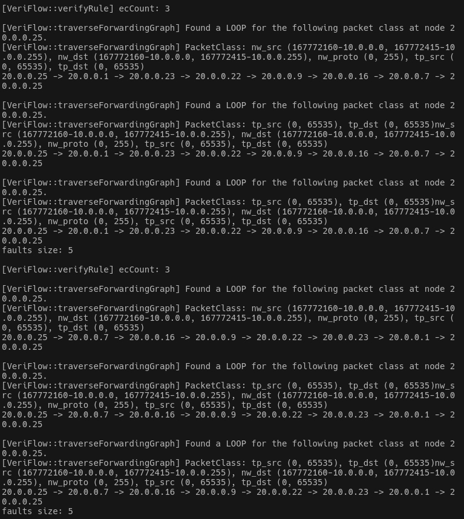
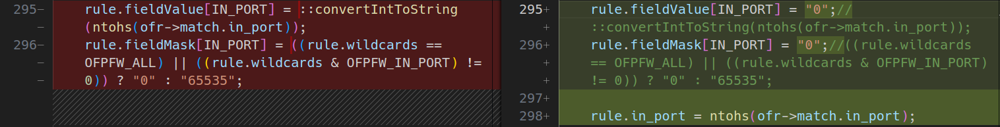
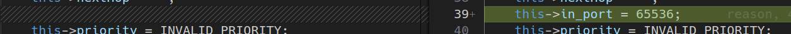
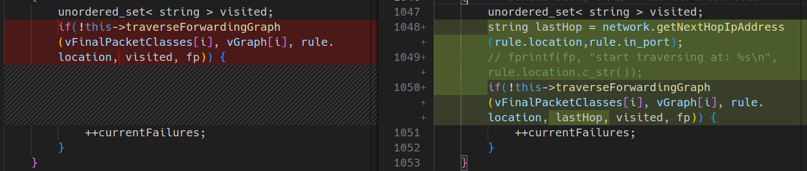

# VeriFlow

## 环境搭建

我在自己电脑上遭遇了严重的环境问题, 经过相当多的时间尝试解决但仍然失败. 感谢助教高奔学长的帮助和环境支持, 本次实验最终在高奔学长提供的环境下完成

> 答案是用arch用的

## 输出EC数量

在`VeriFlow.cpp/VeriFlow::verifyRule()`函数中取消如下注释即可:

```C++
	else
	{
		fprintf(stdout, "\n");
		fprintf(stdout, "[VeriFlow::verifyRule] ecCount: %lu\n", ecCount);
	}
```

## 打印环路路径信息

相关函数是`VeriFlow.cpp/VeriFlow::traverseForwadingGraph()`, 不难发现, 其中参数`visited`是用来标记遍历过的节点的容器, 而原代码中采用的是无序容器`unordered_set`, 因此, 只需要将`unordered_set`改成`vector`即可

有三处需要修改:

1. `VeriFlow.h/VeriFlow::traverseForwadingGraph()`函数声明:

    ```C++
    bool traverseForwardingGraph(const EquivalenceClass& packetClass, ForwardingGraph* graph, const string& currentLocation, const string& lastHop, vector < string > visited, FILE* fp);
    ```

2. `VeriFlow.cpp/VeriFlow::traverseForwadingGraph()`函数实现:

    ```C++
    if (find(visited.begin(), visited.end(), currentLocation) != visited.end())
	{
		fprintf(stdout, "\n");
		fprintf(fp, "\n");
		fprintf(stdout, "[VeriFlow::traverseForwardingGraph] Found a LOOP for the following packet class at node %s.\n", currentLocation.c_str());
		fprintf(fp, "[VeriFlow::traverseForwardingGraph] Found a LOOP for the following packet class at node %s.\n", currentLocation.c_str());
		fprintf(stdout, "[VeriFlow::traverseForwardingGraph] PacketClass: %s\n", packetClass.toString().c_str());
		fprintf(fp, "[VeriFlow::traverseForwardingGraph] PacketClass: %s\n", packetClass.toString().c_str());
		for_each(
			visited.begin(), visited.end(), [&](string item)
			{
				fprintf(stdout, "%s -> ", item.c_str());
				fprintf(fp, "%s -> ", item.c_str());
			}
		);
		fprintf(stdout, "%s\n", currentLocation.c_str());
		fprintf(fp, "%s\n", currentLocation.c_str());
		return false;
	}
	visited.push_back(currentLocation);
    ```

3. `VeriFlow.cpp/VeriFlow::verifyRule()`中的函数调用:

    ```C++
    vector< string > visited;
    ```

## 简化EC输出

相关代码在`EquivalenceClass.cpp/EquivalenceClass::toString()`函数中, 删除多于的输出项即可:

```C++
string EquivalenceClass::toString() const
{
	char buffer[1024];
	// sprintf(buffer, "[EquivalenceClass] dl_src (%lu-%s, %lu-%s), dl_dst (%lu-%s, %lu-%s)",
	// 		this->lowerBound[DL_SRC], ::getMacValueAsString(this->lowerBound[DL_SRC]).c_str(),
	// 		this->upperBound[DL_SRC], ::getMacValueAsString(this->upperBound[DL_SRC]).c_str(),
	// 		this->lowerBound[DL_DST], ::getMacValueAsString(this->lowerBound[DL_DST]).c_str(),
	// 		this->upperBound[DL_DST], ::getMacValueAsString(this->upperBound[DL_DST]).c_str());

	string retVal = buffer;
	// retVal += ", ";

	sprintf(buffer, "nw_src (%lu-%s, %lu-%s), nw_dst (%lu-%s, %lu-%s)",
			this->lowerBound[NW_SRC], ::getIpValueAsString(this->lowerBound[NW_SRC]).c_str(),
			this->upperBound[NW_SRC], ::getIpValueAsString(this->upperBound[NW_SRC]).c_str(),
			this->lowerBound[NW_DST], ::getIpValueAsString(this->lowerBound[NW_DST]).c_str(),
			this->upperBound[NW_DST], ::getIpValueAsString(this->upperBound[NW_DST]).c_str());

	retVal += buffer;
	retVal += ", ";

	// NOT all fields
	// for(int i = 0; i < ALL_FIELD_INDEX_END_MARKER; i++)
	// {
	// 	sprintf(buffer, "Field %d (%lu, %lu)", i, this->lowerBound[i], this->upperBound[i]);
	// 	retVal += buffer;

	// 	if(i < (ALL_FIELD_INDEX_END_MARKER - 1))
	// 	{
	// 		retVal += ", ";
	// 	}
	// }
	sprintf(buffer, "nw_proto (%lu, %lu)", this->lowerBound[NW_PROTO], this->upperBound[NW_PROTO]);
	retVal += buffer;
	retVal += ", ";

	sprintf(buffer, "tp_src (%lu, %lu), tp_dst (%lu, %lu)",
			this->lowerBound[TP_SRC], this->upperBound[TP_SRC],
			this->lowerBound[TP_DST], this->upperBound[TP_DST]);
	retVal += buffer;

	return retVal;
}
```

## 实验结果



## 补丁分析

在原来划分等价类时, 有一个选项是`in_port`, 而补丁的一个主要工作就是将`in_port`从匹配域中分离出来:



在划分等价类时不采用`in_port`, 而是都设置成默认值:



在`verifyRule()`函数中, 添加了`in_port`的判断:



并且添加了`lastHop`等代码来确保上一跳的存在

总而言之, 这个补丁将从不同端口进入的流量划分到一个等价类中, 从而减少了等价类数量, 并且提高了验证速度. 此外, 还增加了最后一跳的验证, 增加了代码的鲁棒性
